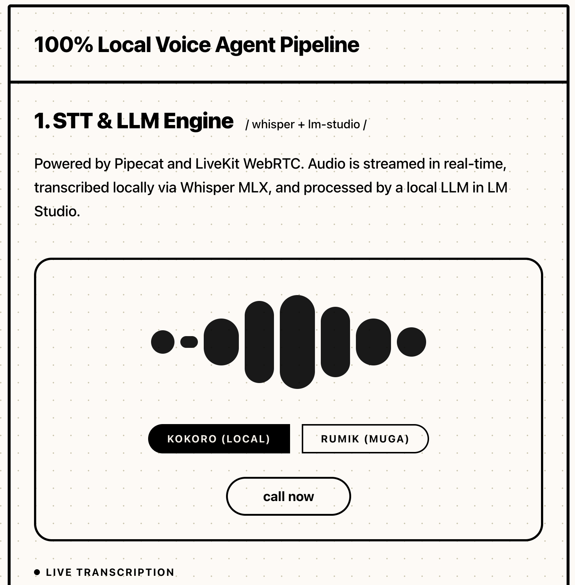

# NeuralEngine Voice Agent

A premium, 100% local, real-time voice agent pipeline built with [Pipecat](https://github.com/pipecat-ai/pipecat) and [LiveKit](https://livekit.io/). This project demonstrates a low-latency, fully open-source voice AI architecture designed to run on Apple Silicon (using MLX) and local inference engines.

## 🌟 Overview
NeuralEngine is a WebRTC-powered voice assistant that runs entirely on your local machine. It combines state-of-the-art open-weight models for Speech-to-Text (STT), Large Language Models (LLM), and Text-to-Speech (TTS) into a seamless conversational interface. 

The frontend provides a sleek, brutalist, and creamy document-style UI that visualizes audio waveforms and displays live transcriptions of the conversation in real-time.



## 🤖 Models & Stack

This project prioritizes speed and local privacy by utilizing the following stack:

- **WebRTC Infrastructure**: [LiveKit Server](https://github.com/livekit/livekit) for ultra-low latency real-time audio streaming.
- **Pipeline Orchestration**: [Pipecat](https://docs.pipecat.ai/) handles the complex graph of audio frames, transcriptions, and LLM context.
- **VAD (Voice Activity Detection)**: **Silero VAD v5** intelligently detects when you start and stop speaking.
- **STT (Speech-to-Text)**: **Whisper MLX** (`mlx-community/whisper-small-mlx-q4`) running natively on Apple Silicon for near-instant transcription.
- **LLM (Reasoning)**: **LM Studio** serving fast local models (e.g., `Qwen1.5-0.5b-chat` or `Llama-3.2-1B-Instruct`) via an OpenAI-compatible API.
- **TTS (Text-to-Speech)**: Features a dynamic client-side toggle to switch between two services:
  - **Kokoro TTS** (voice: `af_heart`): Runs completely locally for fast, on-device synthesis.
  - **Rumik AI** (voice: `Muga`): Uses the `pipecat_rumik` plugin to generate emotionally expressive speech dynamically steered by LLM tone tags (e.g., `[happy]`, `[whisper]`).

## 🏗️ Architecture Flow

The following diagram illustrates the complete end-to-end data flow from the moment the user clicks "Call Now" to the moment the AI responds.

```mermaid
sequenceDiagram
    participant User
    participant Frontend as "Next.js Frontend"
    participant Backend as "FastAPI Backend"
    participant LiveKit as "LiveKit Server"
    participant Pipecat as "Pipecat Pipeline"
    participant Models as "Local Models (Whisper, LM Studio, Kokoro/Rumik)"

    User->>Frontend: Clicks "Call Now"
    Frontend->>Backend: POST /api/token
    Backend-->>Frontend: Returns LiveKit Token & Server URL
    
    Frontend->>LiveKit: Connect via WebRTC
    LiveKit-->>Backend: Webhook / Trigger Worker
    Backend->>LiveKit: Spawn Pipecat Agent & Join Room
    
    User->>Frontend: Speaks into Microphone
    Frontend->>LiveKit: Stream Audio Track (WebRTC)
    LiveKit->>Pipecat: Forward Audio Frames
    
    rect rgb(30, 30, 30)
        Note over Pipecat, Models: Pipecat Internal Processing Loop
        Pipecat->>Models: Silero VAD (Detect Speech)
        Pipecat->>Models: Whisper MLX (Audio -> Text)
        Pipecat->>LiveKit: Emit TranscriptionReceived (User text)
        Pipecat->>Models: LLM via LM Studio (Context -> Streamed Text)
        Pipecat->>Models: Kokoro/Rumik TTS (Streamed Text -> Audio)
        Pipecat->>LiveKit: Emit TranscriptionReceived (Agent text)
    end
    
    Pipecat->>LiveKit: Publish Agent Audio Track
    LiveKit->>Frontend: Stream Agent Audio (WebRTC)
    Frontend->>User: Plays Audio & Updates Live Transcript UI
```



## 🚀 Getting Started

### Prerequisites
1. **LiveKit Server**: Running locally (e.g., `livekit-server --dev`).
2. **LM Studio**: Running locally on port `1234` with a model loaded and the local server started.
3. **Bun / Node.js**: For the Next.js frontend.
4. **uv / Python 3.11+**: For the FastAPI backend.

### 1. Start the Backend
The backend manages the LiveKit tokens, handles Pipecat workers, and explicitly preloads models (Whisper MLX, Kokoro, Silero) on startup to prevent latency on the first call.

```bash
uv run fastapi dev app/main.py
```

### 2. Start the Frontend
The sleek Next.js UI connects to the LiveKit room and handles the microphone hardware.

```bash
cd client
bun install
bun run dev
```

### 3. Talk to the Agent
Open `http://localhost:3000`, click **Call Now**, and start speaking!
